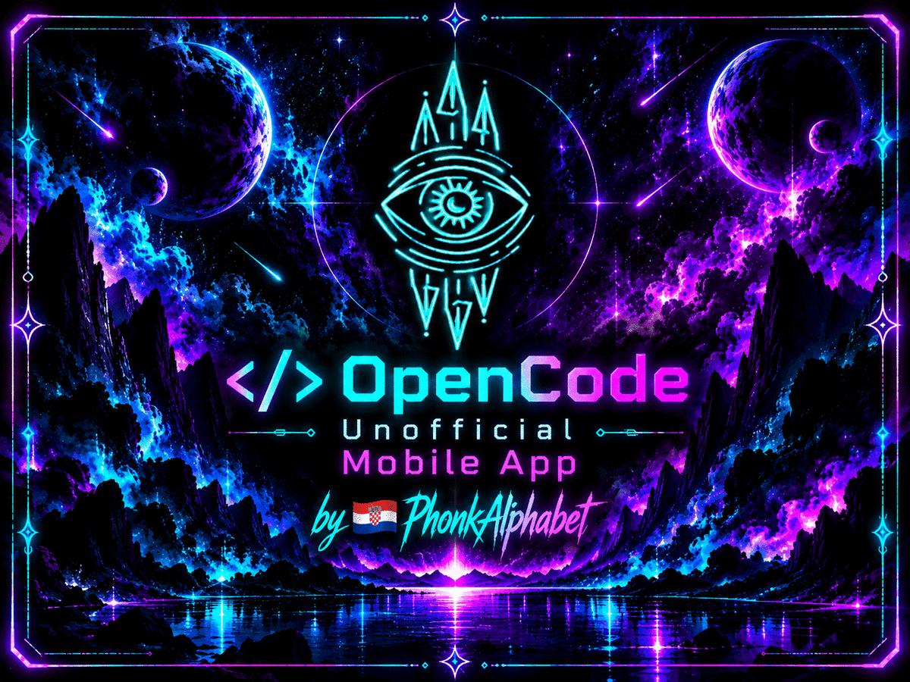
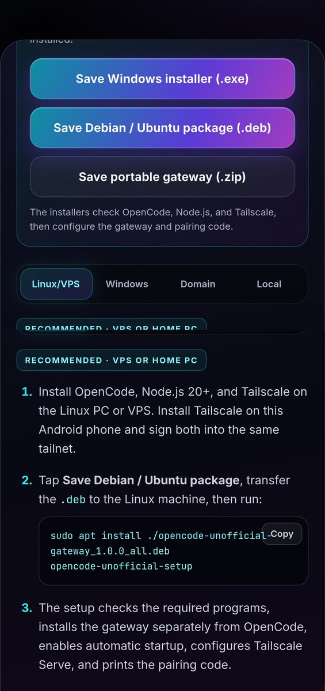
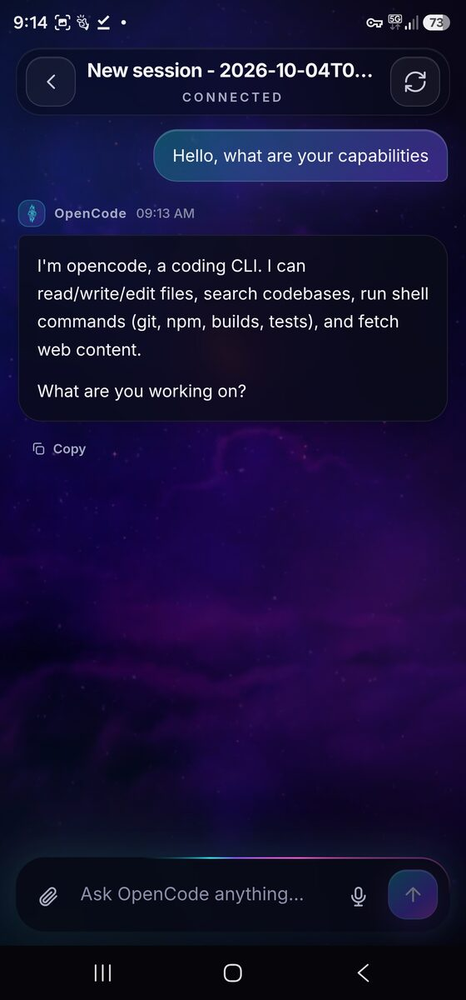
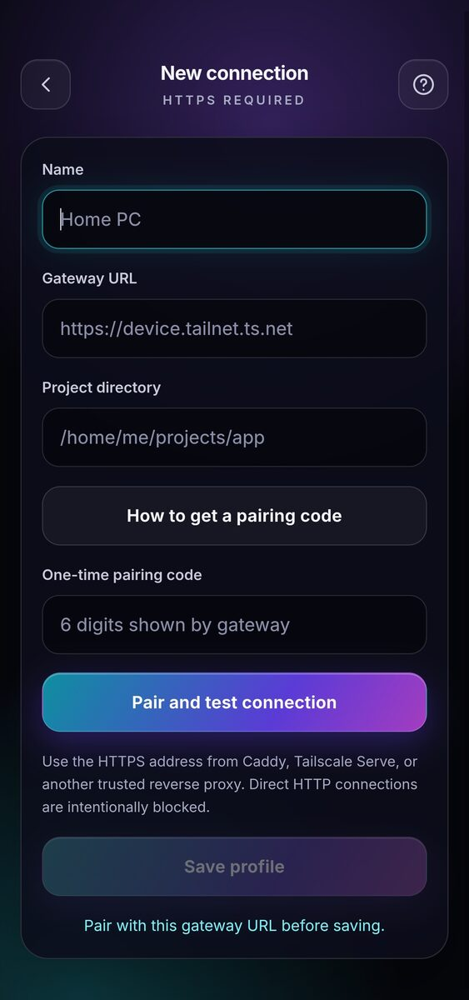
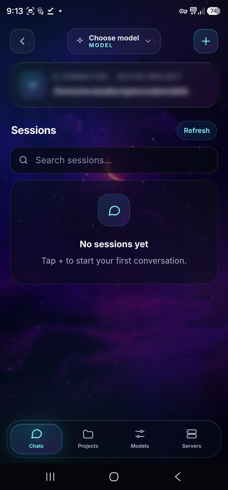

<p align="center">
  
</p>

<p align="center">
  <b>Turn your Android phone into a remote client for OpenCode.</b><br>
  <sub>Projects, files, and credentials stay on your own machine.</sub>
</p>

<p align="center">
  <a href="#download"></a>
  <a href="LICENSE"></a>
  <a href="#security"></a>
  
</p>

---

> **Independent community project.** Not affiliated with, endorsed by, sponsored by, or maintained by the OpenCode project or its maintainers. "OpenCode" is a trademark of its respective owner and is used here only to describe compatibility. See [`LEGAL-NOTICE.md`](LEGAL-NOTICE.md).

---

## What it is

A native Android client that talks to an OpenCode server running on **your** PC, VPS, or home machine. Nothing is hosted. Nothing is proxied through a third party. Your projects, source files, and provider API keys never leave the machine they live on — the phone is a remote view onto it.

You reach that machine over a private HTTPS address, most easily via [Tailscale](https://tailscale.com), so the gateway is never exposed to the public internet.

## Screenshots

| Pair with a one-time code | Stream a full agent turn |
|---|---|
|  |  |

| Manage multiple servers | Your chats and sessions |
|---|---|
|  |  |

---

## Features

**Everyday use**
- Multiple servers, projects, chats, and sessions in one app
- Streaming replies with live tool progress and permission prompts
- Free-form, connected, and full-detail model views
- OpenRouter plus any custom OpenAI-compatible endpoint
- File, image, and PDF attachments up to 8 MB
- Android share sheet — send text or files from any app straight into a chat
- Voice dictation via your system voice app
- Rich Markdown: syntax-highlighted code, tables, diffs, copy buttons

**Interface**
- Obsidian Aurora theme — animated cosmic background, translucent glass panels, cyan-to-purple-to-pink accents
- Iridescent live-response ring that reacts as the model works
- Fluid transitions, subtle motion, and a typewriter reveal
- Composer stays above the keyboard, including on Android 15 edge-to-edge

**Security**
- Pair over HTTPS with a single-use six-digit code
- Every phone gets its own revocable credential, stored in Android Keystore
- The gateway stores only credential hashes, never plaintext tokens
- Binds to loopback by default and refuses non-loopback binding unless explicitly enabled
- Rate-limited failed logins and timing-safe token comparison
- Provider keys never touch the phone

**Sharing**
- The first phone to pair becomes **owner**
- Add further phones as members
- Revoke one phone without disconnecting the others
- Transfer ownership if you change phones
- Recover access locally from the gateway if you lose every owner device
- Live gateway health, version, and paired-device count visible in-app

**Setup**
- Export the gateway from inside the app: Windows `.exe`, Debian/Ubuntu `.deb`, or portable `.zip`
- Installers verify OpenCode, Node.js 20+, and Tailscale before proceeding
- Installs alongside OpenCode without modifying it
- Configures startup, then prints your HTTPS address and pairing code

---

## Download

Binaries are committed in this repository under [`releases/v1.0.0/`](releases/v1.0.0/) — clone the repo or download a single file from the browser, no archive extraction needed. The same files are attached to the [Releases page](https://github.com/masterfrequency/OpenCode-Unofficial-Mobile-App/releases/tag/v1.0.0).

**Install the app — [`OpenCode-Unofficial-v1.0.apk`](releases/v1.0.0/OpenCode-Unofficial-v1.0.apk)**

| Artifact | Platform | Notes |
|---|---|---|
| [`OpenCode-Unofficial-v1.0.apk`](releases/v1.0.0/OpenCode-Unofficial-v1.0.apk) | Android 8.0+ | Direct install. Enable "install from unknown sources" first. |
| [`OpenCode-Unofficial-v1.0.aab`](releases/v1.0.0/OpenCode-Unofficial-v1.0.aab) | Android | For Play Store or bundletool distribution. |
| [`OpenCode-Unofficial-Setup-v1.0.exe`](releases/v1.0.0/OpenCode-Unofficial-Setup-v1.0.exe) | Windows x64 | Self-contained gateway installer. |
| [`opencode-unofficial-gateway_1.0.deb`](releases/v1.0.0/opencode-unofficial-gateway_1.0.deb) | Debian / Ubuntu | Requires Node.js 20+. |
| `OpenCode-Unofficial-v1_0_0-source.zip` | Any | Same source as this repo, as a single archive. |

**SHA-256**

```
b7a493f6793e750303bf49985eeb198ca52cab9fecabb2e7d614fa0a5a503590  OpenCode-Unofficial-v1.0.apk
db237e46a415476ff116107f58b0275621f35714cd900463e332264b7dca3c8f  OpenCode-Unofficial-v1.0.aab
50223e940f986b75a8bdb78d92fb393489685e746b7b991855eeef32cdae1982  opencode-unofficial-gateway_1.0.deb
62efcb9209463b9817592a3af5482b43f9cec250633230940fa06b39168b63d8  OpenCode-Unofficial-Setup-v1.0.exe
94a2a30a49bca843be764a12a8b6cca0c0ce0b1acfeeca45a25cda2b1044fac2  OpenCode-Unofficial-v1_0_0-source.zip
```

Verify before installing:

```bash
sha256sum OpenCode-Unofficial-v1.0.apk
```

---

## Getting started

### 1. Prepare the machine

Install [OpenCode](https://github.com/sst/opencode), [Node.js](https://nodejs.org) 20 or newer, and [Tailscale](https://tailscale.com).

Run OpenCode once so it creates your projects and provider credentials.

### 2. Install the gateway

On your machine — **not** your phone — open the app, tap **Help → Export gateway**, and pick your platform:

```bash
# Linux portable
unzip opencode-unofficial-gateway.zip && cd gateway
chmod +x start.sh
./start.sh

# Debian / Ubuntu
sudo apt install ./opencode-unofficial-gateway_1.0.deb
opencode-unofficial-setup

# Windows
OpenCode-Unofficial-Setup-v1.0.exe
```

The gateway is installed **separately** from OpenCode. It never modifies your OpenCode installation, config, or credentials.

### 3. Connect over Tailscale

The installer prints an HTTPS address such as `https://your-machine.tailnet.ts.net:8443`. Use it in the app.

Keep the gateway bound to loopback unless you specifically need container networking:

```bash
GATEWAY_HOST=127.0.0.1 ./start.sh           # default, recommended
GATEWAY_HOST=0.0.0.0 ALLOW_NON_LOOPBACK_GATEWAY=true ./start.sh   # containers only
```

**Never publish the gateway port directly to the internet.** It is designed to be reached over a private Tailnet, not exposed.

### 4. Pair

Enter the six-digit code the installer printed. It is single-use and expires after 60 minutes. The first phone to pair becomes owner.

---

## Gateway configuration

All settings are environment variables, read at startup.

| Variable | Default | Purpose |
|---|---|---|
| `GATEWAY_PORT` | `4174` | Listen port. Publish it on loopback only. |
| `GATEWAY_HOST` | `127.0.0.1` | Bind address. Changing this needs `ALLOW_NON_LOOPBACK_GATEWAY`. |
| `ALLOW_NON_LOOPBACK_GATEWAY` | `false` | Must be explicitly `true` to bind a non-loopback address. |
| `OPENCODE_REMOTE_TOKEN` | — | Your gateway credential. Treat as a root secret. |
| `OPENCODE_URL` | `http://127.0.0.1:4096` | Upstream OpenCode server. |
| `PAIRING_TTL_MINUTES` | `60` | Pairing code lifetime, `5`–`1440`. |
| `PAIRING_CODE_FILE` | next to `server.mjs` | Pairing code location. Point at writable storage. |
| `DEVICE_STORE_FILE` | next to `server.mjs` | Device registry. **Must be writable and persistent.** |
| `PAIRING_RATE_LIMIT` | `10` | Failed pairing attempts before backoff. |

`PAIRING_CODE_FILE` and `DEVICE_STORE_FILE` are separate on purpose: the pairing code may be ephemeral (a fresh code per restart is correct), but the device registry **must survive restarts** or every paired phone is silently revoked.

### Device administration

```bash
DEVICE_STORE_FILE=~/.opencode-gateway/.devices.json node device-admin.mjs list
DEVICE_STORE_FILE=~/.opencode-gateway/.devices.json node device-admin.mjs promote <device-id>
DEVICE_STORE_FILE=~/.opencode-gateway/.devices.json node device-admin.mjs revoke  <device-id>
DEVICE_STORE_FILE=~/.opencode-gateway/.devices.json node device-admin.mjs reset --confirm
```

`reset` wipes every paired device and requires explicit confirmation. Use it when you have lost all owner devices.

---

## Repository layout

The full source is committed to this repository. Clone it and you have everything needed to build the app and run the gateway.

```
app/         Android client (Java + WebView assets)
  src/main/java/dev/phonkalphabet/opencode/mobile/
             MainActivity.java — WebView host, share intents, voice, file chooser
             TokenVault.java    — Android Keystore credential storage
  src/main/assets/
             app.js, ui.js, app.css, index.html — the web interface
             opencode-unofficial-gateway.zip  — gateway, shipped inside the app
gateway/     Node gateway (no npm dependencies)
  server.mjs        — HTTP server, pairing, per-device credentials
  device-admin.mjs  — list / promote / revoke / reset CLI
  *.sh, *.ps1       — service install and startup scripts
packaging/   Windows (.exe) and Debian (.deb) installer sources
releases/    Signed release binaries, tracked in git
v1.0.0/      APK, AAB, Windows installer, Debian package
.github/workflows/release.yml
```

---

## Building from source

Requirements: JDK 17+, Android SDK, Node.js 20+.

```bash
git clone https://github.com/masterfrequency/OpenCode-Unofficial-Mobile-App.git
cd OpenCode-Unofficial-Mobile-App

cp keystore.properties.example keystore.properties   # fill in your own signing key
./gradlew assembleRelease
```

The gateway is plain Node with no dependencies:

```bash
cd gateway && node --check server.mjs
```

Prebuilt binaries are on the [Releases page](https://github.com/masterfrequency/OpenCode-Unofficial-Mobile-App/releases).

> **Known build issue:** `versionCode` is currently `1`. Android refuses to install an update whose code is not higher than the installed one, so an in-place upgrade from any earlier build will fail and require an uninstall. Bump `app/build.gradle` before shipping a follow-up release.

---

## Security

Report vulnerabilities privately via [GitHub Security Advisories](https://docs.github.com/en/code-security/security-advisories), not a public issue. See [`SECURITY.md`](SECURITY.md).

The gateway's threat model assumes the machine it runs on is trusted and that the Tailnet is private. It protects the phone-to-gateway link and the device credential lifecycle; it does not defend a compromised host.

- Tokens are compared in constant time
- Failed pairing attempts are rate-limited
- The device store is written atomically via temp-file-and-rename
- The app stores credentials in Android Keystore and strips them from local storage
- Native URL handling allows only `http://` and `https://`

---

## Troubleshooting

**Pairing code rejected.** Codes are single-use and expire after 60 minutes. Restart the gateway or run the setup command again for a fresh one.

**`opencode: false` in gateway health.** The gateway is up but cannot reach OpenCode. Check that OpenCode is running and that `OPENCODE_URL` matches the port it prints.

**Gateway refuses to start on a non-loopback address.** Intentional. Set `ALLOW_NON_LOOPBACK_GATEWAY=true`, or keep `GATEWAY_HOST=127.0.0.1` and reach it through Tailscale Serve or a local reverse proxy.

**Phone lost.** Run `device-admin.mjs reset --confirm` on the machine, then pair again.

**Everything looks connected but models fail.** Confirm provider credentials live on the **machine**, in OpenCode. The app intentionally never stores them.

---

## Contributing

Issues and pull requests are welcome. Please read [`SECURITY.md`](SECURITY.md) first if your change touches authentication, the device store, or credential handling.

## Credits

- **Inter** and **JetBrains Mono**, both under the SIL Open Font License 1.1 — licence texts in `app/src/main/assets/fonts/`
- [Tailscale](https://tailscale.com) for private remote access
- The OpenCode project, whose server this client drives

## License

MIT — see [`LICENSE`](LICENSE). Bundled fonts remain under the SIL Open Font License 1.1.

<p align="center">
  Made with 💜 by 🇭🇷 <a href="https://github.com/masterfrequency">PhonkAlphabet</a>
</p>